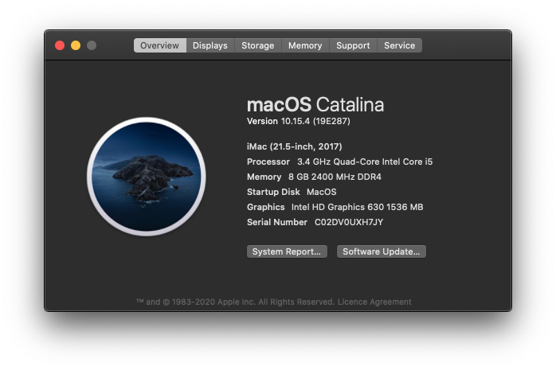
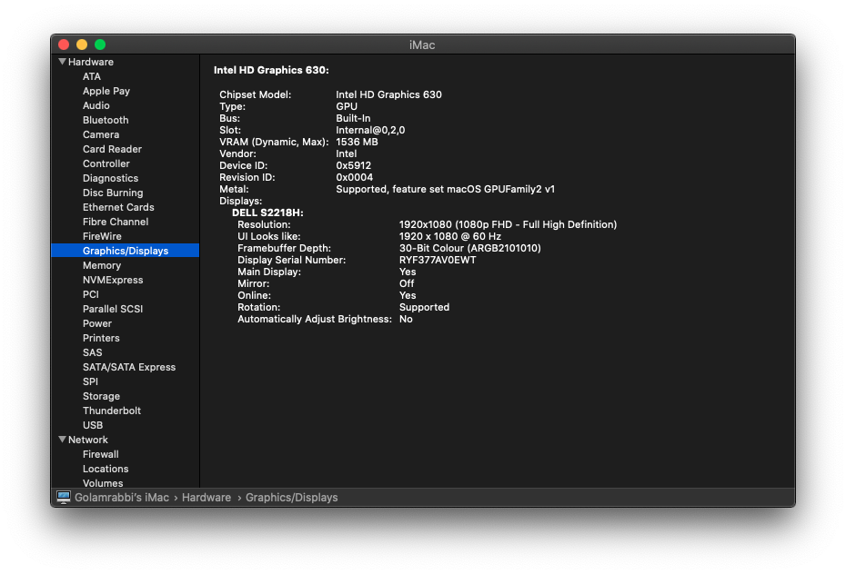
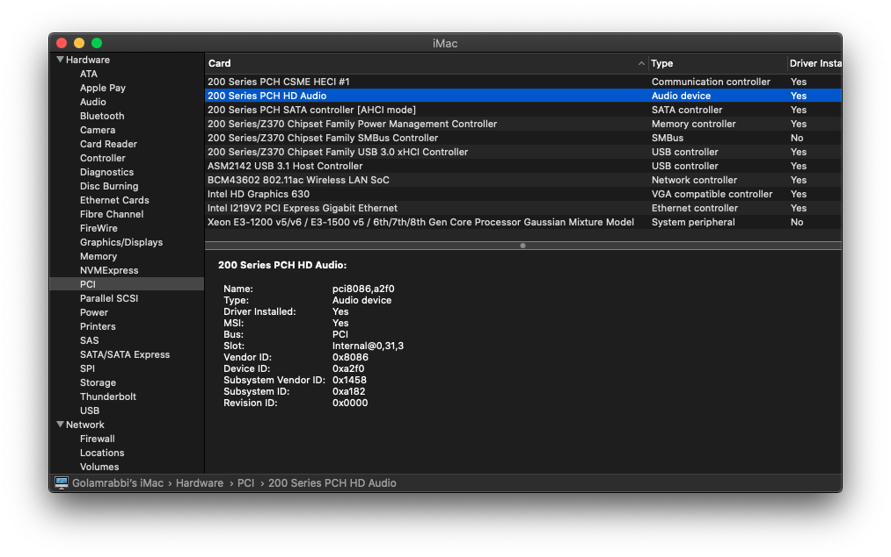
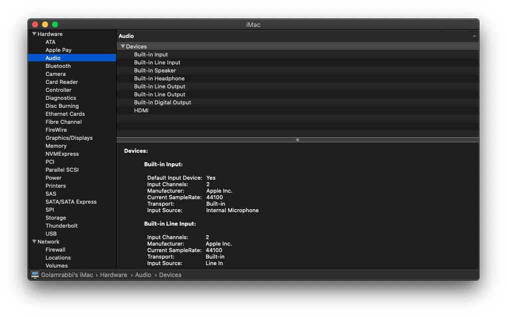

# Gigabyte Sniper B8 with Core i5-7th gen Hackintosh

***Native Support with this Specification.​ (OUT OF THE BOX)***

### _This is the last version of Catalina i'm runing. I'm making this machine as a fully for gaming. And this repo is no longer maintained or updated. I'll upload all the kexts, patches and plist file. Avoid errors, stuck at boot, etc make sure create a plist your own._

## Full Specs:

**iMac (21.5-inch, 2017)**

| Components  | Details                          |
| ----------- | -------------------------------- |
| Motherboard | Gigabyte G1 Sniper B8            |
| CPU         | 3.41 GHz Quad-Core Intel Core i5 |
| RAM         | Corsair 8 GB 2400 MHz DDR4       |
| Storage     | Kingstone Q-360 SSD (360GB)      |
| GPU         | Intel HD Graphics 630 1536 MB    |

## Graphics

There is lot of issue you may face because of choosing wrong GPU. And you just be clear with it that Nvidia is no longer part of the macOS family > High Sierra 10.13.6. 

A guide of buying graphics card. [Read Here](https://khronokernel-3.gitbook.io/gpu-buyers-guide/)

If you already have AMD R7, R9 graphics card series make sure you read the repo. [Read Here](https://github.com/golamrabbiazad/amd-r7_r9-qe-ci)

## PCIe Card patches

## Wi-Fi and Bluetooth

**Broadcom BCM43602 802.11ac** Wireless LAN SoC.

Brought from [AliExpress](https://www.aliexpress.com/)

+ Built-in Bluetooth
+ Built-in AirDrop
+ Built-in SideCar

## Clover EFI

~~Hackintosh from **[Olarila.](https://olarila.com/)**~~ **Dropped using Olarila.** 

Clover Bootloader

- Bootargs `dart=0`

- **EFI Version: 181.0.0.0.0**

Olarila full guide: [Hackintosh Guide](https://www.olarila.com/topic/5794-hackintosh-guide-install-macos-with-olarila-image-step-by-step-install-and-post-install-windows-or-mac/)

Note: Time to time link may change or if this provided link not working please go out their site and follow the guide.

_And moved to OpenCore Bootloader at the version 10.15.2_

## Audio

AppleALC

This motherboard has Realtek® ALC1220 Audio Codec and It's **Inject ID: 28**

## OpenCore Development

So, what is OpenCore?

> OpenCore is completely new way to boot up the macOS system. It is blazingly fast to boot and kind of work like a native mac.

***And It is highly not recommended for beginners or new to  hackintosh because lot of things setup, configure plist file manually.  Well if you want to try it out make sure backup your EFI files. Then you can follow lot of youtube tutorials step by step to make your system  up.\***

To setup vanilla opencore follow the guide: [OpenCore Guide](https://khronokernel-2.gitbook.io/opencore-vanilla-desktop-guide/)

The main repo/development or maintained [here](https://github.com/acidanthera/OpenCorePkg)

**Current OpenCore Booted Version: 0.5.7**

## Thanks

to all members from the **@Hackintosh** facebook group. They helped me a lot at the beginning of my Hackintosh journey.

**@olarila** for the clover guide.

**@acidanthera** for various patches, audio, graphics, ethernet support.

**@headkaze** for the **[Hackintool](https://www.github.com/headkaze/Hackintool)** which keeps me up-to-date with kexts, OpenCore versions and PCIe patches.

and to **@apple** 😀
