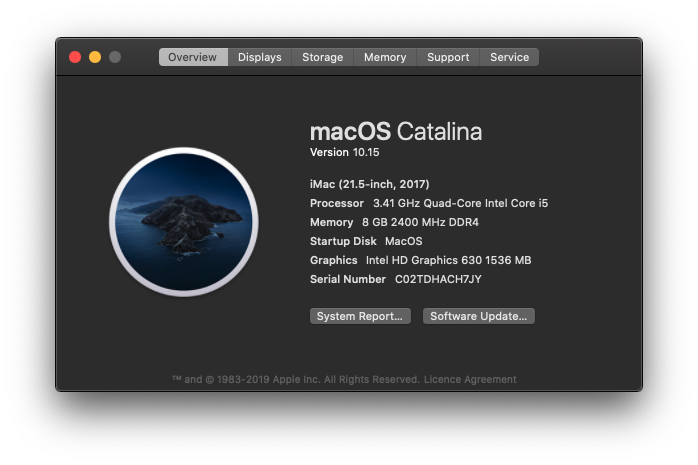

# Hackintosh Full Setup Guide

***Native Supported with this Specification.​ (OUT OF THE BOX)***

---

### <u>Full Specs:</u>

- [x] **Motherboard:** Gigabyte G1 Sniper B8
- [x] **CPU:** Intel Core i5-7500 (3.41GHz)
- [x] **RAM:** Corsair 8GB DDR4 2400MHz
- [x] **Memory:** Q-360 SSD
- [x] **GPU:**  Intel HD Graphics 630 1536 MB
- [x] **SMBIOS:** iMac 18,1

### Wi-Fi & Bluetooth

------

Broadcom BCM43xx with built-in Bluetooth.

### EFI

----

Hackintosh from [Olarila.](https://olarila.com/)

- Bootargs `dart=0, -no_compat_check`

- Clover Bootloader
- **EFI Version: 175.0.0.0.0**

### Kext

---

- [x] AppleALC - **Codec Inject id: 28**
- [x] FakeSMC
- [x] IntelMausi
- [x] Lilu - ***Fix system kernel panic***
- [x] NoTouchID
- [x] RealtekRTL8100
- [x] RealtekRTL8111
- [x] USBInjectAll
- [x] VoodooPS2Controller
- [x] WhateverGeen - ***Native Graphics support***
- [x] XHCI - Unsupported