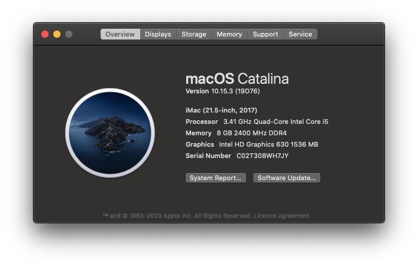

# Hackintosh PC Details

***Native Support with this Specification.​ (OUT OF THE BOX)***

---

### <u>Full Specs:</u>

- [x] **Motherboard:** Gigabyte G1 Sniper B8
- [x] **CPU:** Intel Core i5-7500 (3.41GHz)
- [x] **RAM:** Corsair 8GB DDR4 2400MHz
- [x] **STORAGE:** Q-360 SSD (360GB)
- [x] **GPU:**  Intel HD Graphics 630 1536 MB
- [x] **SMBIOS:** iMac18,1

### Wi-Fi & Bluetooth

------

Broadcom BCM43602 802.11ac Wireless LAN SoC

+ Built-in Bluetooth
+ Built-in AirDrop
+ Built-in SideCar

### EFI

----

Clover Bootloader

- Bootargs `dart=0`

- **EFI Version: 180.0.0.0.0**

### Audio

---

AppleALC - **Codec Inject id: 28**

Hackintosh from **[Olarila.](https://olarila.com/)** 

#### OpenCore Coming Soon...